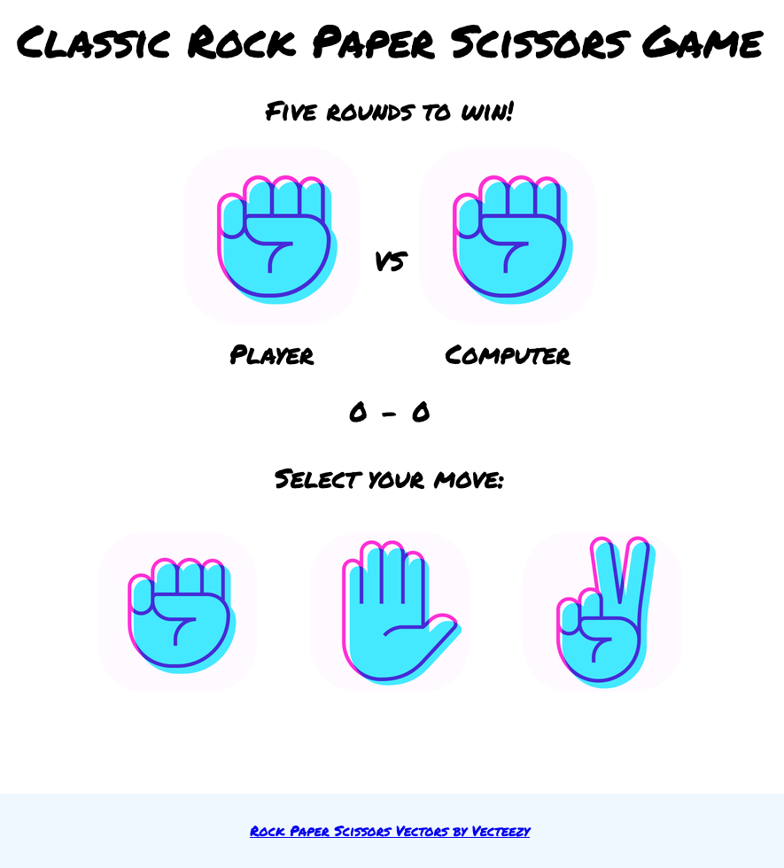

# Rock Paper Scissors

This project is a simple implementation of the "rock paper scissors" game. This will determine what I learned from each of the lessons under **_Foundations > JavaScript Basics_**. For the moment, this will only run on the browser console. A more improved version of this program will come later on with an added GUI.

### Update

- Improved the game's functionality with an added user interface.
- The code has been refactored.

## Prerequisite

- Fundamentals Part I
- Fundamentals Part II
- JavaScript Developer Tools
- Fundamentals Part III
- Problem Solving
- Understanding Errors

## Source

The Odin Project (https://www.theodinproject.com/paths/foundations/courses/foundations/lessons/rock-paper-scissors)
